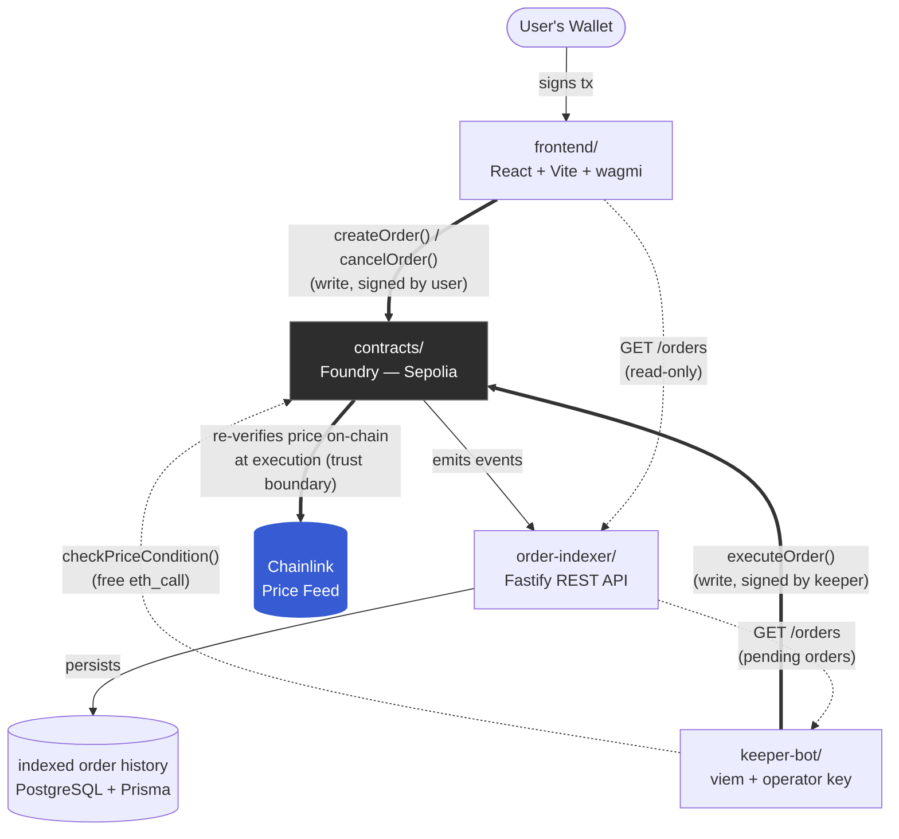

# OrderKeeper

A decentralized limit-order keeper bot for EVM chains. Users deposit funds and define a price condition (e.g. "sell 1 ETH when price >= $4,000"); an off-chain keeper bot monitors Chainlink price feeds and automatically executes the swap via Uniswap when the condition is met, earning a small fee for the service.

## Table of Contents

- [Problem Statement](#problem-statement)
- [Why This Project](#why-this-project)
- [Architecture](#architecture)
- [Design Decisions](#design-decisions)
- [Security Considerations](#security-considerations)
- [Known Limitations & Tradeoffs](#known-limitations--tradeoffs)
- [On-Chain Activity](#on-chain-activity)
- [Testing Plan](#testing-plan)

---

## Problem Statement

Limit orders are a basic trading primitive on centralized exchanges, but on-chain DEXs (like Uniswap) only support market swaps — there's no native way to say "execute this trade only when price reaches X" without either trusting a centralized service or manually watching the market yourself.

OrderKeeper uses trust-minimized execution: funds are custodied by a smart contract, execution conditions are verified on-chain against a Chainlink oracle, and anyone can run the keeper bot that triggers execution. The contract owner still controls oracle configuration, as documented below.

---

## Why This Project

- **Real income potential**: the keeper fee mechanism means this isn't just a demo — it's a monetizable service.
- **Architecturally simple, not over-engineered**: unlike MEV liquidation/arbitrage bots (which require simulating market conditions that don't organically exist on testnet), OrderKeeper works end-to-end on Sepolia using a real Chainlink feed and real Uniswap liquidity.
- **Trust-minimized keeper design**: the bot only *triggers* execution — the contract independently re-verifies the price against Chainlink before moving any funds, so a compromised or buggy bot cannot supply a false execution price.

---

## Architecture

Four components, each with a single responsibility (simple microservices over a monorepo):

Thick arrows = on-chain writes into `contracts/` (or the contract's own on-chain re-check of Chainlink); dashed arrows = off-chain reads and monitoring, which never touch the write path.

### 1. `contracts/` — On-chain core
Custodies order funds, verifies price conditions on-chain, executes swaps.
- **Stack**: Foundry, OpenZeppelin (`IERC20`, `ReentrancyGuard`), Chainlink `AggregatorV3Interface`, Uniswap V2 router interface
- **Core logic**: `createOrder()`, `executeOrder()` (re-validates price on-chain before executing), `cancelOrder()`, keeper fee on successful execution

### 2. `order-indexer/` — Event listener + read API
Listens for `OrderCreated` / `OrderExecuted` / `OrderCancelled` events, persists them, and exposes them over a REST API (`GET /orders`, optionally filtered by `status` and/or wallet `owner`) so the frontend and keeper don't need to query the chain directly on every read.
- **Stack**: Node.js, TypeScript, Fastify (REST API), viem (`eth_getLogs` polling for live events, chunked backfill with 429 backoff), PostgreSQL + Prisma
- **Read-only**: never sends transactions, never holds a private key — smaller attack surface by design. It only serves reads of indexed history; it never sits in the write path — order creation and cancellation go directly from the frontend to the contract

### 3. `keeper-bot/` — Executor
Polls `order-indexer`'s REST API for pending orders (see [Design Decisions](#design-decisions)), then re-checks each one's price condition via the contract's own `checkPriceCondition()` — a free `eth_call`, not an independent Chainlink read — before calling `executeOrder()`. This keeps the off-chain trigger logic from ever silently drifting apart from what `executeOrder()` itself re-verifies.
- **Stack**: Node.js, TypeScript, viem — holds its own operator private key (separate from user funds) to sign and send execution transactions

### 4. `frontend/` — User interface
Wallet connection, order creation/cancellation, and a wallet-scoped **My Orders** history/status view. The owner filter is a UX convenience, not privacy or authentication; Sepolia activity remains public.
- **Stack**: React + Vite + TypeScript (pure SPA, no SSR), viem, wagmi for wallet connection
- **Direct-to-contract writes**: order creation and cancellation are signed by the user's wallet and sent straight to the contract via wagmi/viem — the frontend talks to `order-indexer` only to read order history

---

## Design Decisions

### Trigger vs. verification are separate concerns

Two things are often conflated in "keeper bot" designs, and OrderKeeper
deliberately keeps them separate:

- **(a) Who monitors price and triggers execution** — an off-chain process
  that watches the market and decides *when* to call `executeOrder()`.
- **(b) Where the price is verified before funds move** — this is
  non-negotiable and always happens on-chain, inside `executeOrder()`,
  directly against Chainlink. See [Security Considerations](#security-considerations)
  below for the full reasoning; in short, the keeper bot is trusted only as
  a trigger, never as a price source, so nothing about (a) can ever weaken
  (b).

Because (b) is fixed, the only real design question is (a): *which*
off-chain process gets to call `executeOrder()`.

### Trigger choice: self-run `keeper-bot`, not Chainlink Automation

For (a), OrderKeeper uses a self-run `keeper-bot` (`viem` + its own
operator private key) rather than Chainlink Automation.

This is a deliberate trade-off, not an oversight:

- **What Chainlink Automation would have bought us**: it runs independently
  of any machine I have to keep online, so uptime wouldn't depend on a
  personal bot staying up.
- **What it would have cost**: LINK funding to keep upkeeps running, and —
  more importantly for this project — loss of direct visibility into
  exactly how and when triggers fire, since that logic would live inside
  Chainlink's infrastructure instead of in a bot I wrote and can read
  end-to-end.
- **Why self-run won anyway**: architectural transparency and consistency
  with this project's simplicity preference (see `CLAUDE.md`'s
  Conventions) outweighed production-grade uptime here. This mirrors the
  same reasoning already applied to the time-check oracle pattern in the
  Module 13 `RWAAssetToken` assignment — understanding every moving part
  end-to-end matters more than uptime guarantees for a bootcamp capstone,
  which is not a live production service.

### This is a reversible choice

Chainlink Automation remains a valid future upgrade path if uptime becomes
a real concern post-MVP. Swapping the trigger source doesn't require
redesigning `executeOrder()`'s on-chain verification logic — that logic
doesn't care who calls it, only that the price it independently re-checks
against Chainlink is correct at call time. This door is intentionally left
open, not closed.

### `keeper-bot`'s order source: `order-indexer`, not direct contract reads

`keeper-bot` reads pending orders from `order-indexer`'s REST API rather
than querying the contract directly — faster reads, at the cost of
`keeper-bot` now depending on the indexer staying online and in sync.
Decided during scaffolding (2026-08-16); direct contract reads remain a
fallback path if indexer freshness ever becomes a concern.

### One real pair, traded in both directions — no per-order asset selector

An earlier revision gave each order an `asset` field used solely to
select which Chainlink feed the price condition read — the swap itself
always traded `weth` for `quoteToken` regardless, so picking, say, LINK
never let anyone actually trade LINK. That field is gone. Auditing what a
genuine multi-asset version would require surfaced the real blocker: no
Uniswap V2 pool exists for LINK on Sepolia at all, and the WBTC pool that
does exist is mispriced ~47% against its oracle. Multi-asset trading
couldn't have been made real on this testnet without seeding pools first
(see Milestone 12 in `ROADMAP.md`).

The shipped design instead trades the one pair that has real liquidity —
WETH/quoteToken — in both directions, via `Order.side` (`Sell`/`Buy`).
Sell deposits ETH and swaps `weth` for `quoteToken` when ETH's price
rises to target; Buy deposits `quoteToken` and swaps it for `weth` when
ETH's price falls to target. Both directions gate on the same value —
ETH's price, via `getAssetPrice(weth)` — regardless of side; there's no
separate "condition token" to select, since there's only one asset whose
price could plausibly matter for either direction of this pair. `weth` is
still resolved from the Uniswap router's own `WETH()` at construction and
immutable from then on, so the swap path can never drift from what the
router itself requires. Decided 2026-08-17, redesigned 2026-08-29
(Milestone 15).

---

## Security Considerations

- **Access control**: only the order owner can cancel their own order
- **Reentrancy protection**: `ReentrancyGuard` on any function moving funds; strict checks-effects-interactions ordering
- **Oracle trust boundary**: execution price is verified on-chain via Chainlink at execution time — the keeper bot is never trusted as a price source, only as a trigger
- **Key isolation**: the keeper bot's operator key is fully separate from user funds and from the indexer (which holds no key at all)
- **Owner-controlled oracle configuration**: the contract owner can replace the WETH price-feed address. Users therefore trust the owner not to install a malicious, invalid, or permanently stale feed; users retain the ability to cancel pending orders, and swap slippage remains bounded by each order.

---

## Known Limitations & Tradeoffs

### Practical MVP numeric domain

The EVM ABI permits theoretical `uint256` values far beyond realistic order
economics. The indexer preserves amount and price values exactly in
`NUMERIC(78,0)`, but deliberately supports order IDs only through PostgreSQL's
signed `INTEGER` maximum and expiries within JavaScript's representable Date
range. Encountering a value outside that application domain fails indexing
clearly and leaves the block checkpoint unchanged; it is never truncated,
rounded, or silently skipped. This off-chain limitation does not change the
deployed contract's interface or behavior.

### Accepted MVP finality limitation

The indexer intentionally processes the latest available Sepolia block with
zero confirmation delay so new and executed orders appear quickly during the
demo. It does not store block hashes or roll back database state after a chain
reorganization. A reorg can therefore diverge the indexed view from canonical
chain history. Confirmation-depth indexing and block-hash reconciliation are
post-MVP reliability work.

### Accepted MVP slippage tolerance limitation

Manual Sepolia testing has empirically needed `maxSlippageBps` around 3000
(30%) for reliable execution — far above what a real order would ever
reasonably use. This is a testnet liquidity artifact, not a property of
`OrderKeeper` itself; tracing the actual formula and live pool state below
shows why, rather than asserting it.

**Two protections that are easy to conflate, and are not the same thing:**

- **Price condition (the trigger)**: `executeOrder()` re-reads Chainlink via
  `getAssetPrice(weth)` and only proceeds if `order.condition` holds against
  `order.targetPrice`. This is the non-negotiable trust boundary described in
  [Security Considerations](#security-considerations) — it decides *whether*
  an order is allowed to execute at all.
- **Execution slippage protection (`maxSlippageBps`)**: separately,
  `_minAmountOut()` computes the minimum acceptable Uniswap output —
  `amountOutMin` — from that same Chainlink price, assuming `quoteToken` is
  USD-pegged 1:1, then discounts it by `maxSlippageBps`. This decides whether
  the swap's *actual* output was close enough to that oracle-derived fair
  value to be worth executing. It never queries Uniswap's own quote for this
  — only Chainlink.

Both gate on Chainlink; `amountOutMin` never trusts the pool's own price. That
matters here because it means a poor deal against Uniswap always shows up as
a real revert (`INSUFFICIENT_OUTPUT_AMOUNT`), never a silently-accepted bad
fill.

**Why that produces a real gap on Sepolia.** `_minAmountOut()` assumes the
pool would fill at (approximately) the oracle price. On a real, arbitraged
DEX pool that's a reasonable assumption. The Sepolia WETH/`quoteToken` pool
this MVP seeds is not arbitraged — nothing trades it except this project's
own test orders — so its reserves can sit away from the oracle price
indefinitely, and it is shallow (recorded here as an explicit measurement,
not carried forward as a permanent number, since it moves with every trade
and every `DeployOrderKeeper.s.sol` reseed): roughly 1 WETH deep at the time
of writing. A real Uniswap V2 swap against a pool that size incurs
significant constant-product price impact (`x*y=k`, plus the pool's own 0.3%
fee) for any order that isn't tiny relative to the pool — on top of whatever
the reserve ratio has drifted from Chainlink.

Measured directly against the live pool while writing this section (state at
that moment; both numbers move over time):

- Pool reserves implied an ETH price roughly 3.4% above the live Chainlink
  read.
- A small Sell (0.001 ETH) executed within 1% slippage — the drift happened
  to favor that direction at that size.
- A small Buy (5 `quoteToken`) needed slippage above 3% and below 10% to
  clear — the same drift works against Buy, since the pool was priced richer
  in ETH than the oracle.
- A Buy roughly 100x larger (500 `quoteToken`, still under half the pool's
  own depth) needed slippage in the 20%+ range purely from price impact,
  independent of the drift above.

So the ~30% figure that has worked reliably in practice isn't a fixed
constant OrderKeeper requires — it's headroom wide enough to absorb whatever
combination of drift and price impact a given manual test order happens to
hit, on a pool this shallow and unarbitraged. Smaller orders on a
favorably-drifted day can clear on single-digit percent tolerance, as shown
above; the same order type on a different day, or a larger order any day,
can need much more.

**This is a testnet-only workaround, not a production policy.** A mainnet or
liquid-L2 deployment (see `ROADMAP.md`'s Mainnet/L2 milestone) would sit
against real, continuously-arbitraged liquidity, where the gap between
Chainlink and the pool's executable price stays consistently narrow — a
production deployment should use a materially tighter `maxSlippageBps`
appropriate to that liquidity, not copy the Sepolia testing value forward.

**Two contributing factors worth naming explicitly:**

- `DemoUSDC.mint()` is deliberately unrestricted (see
  `contracts/src/DemoUSDC.sol`) — anyone can mint arbitrary `quoteToken` and
  add or remove it from the pool, which is a further, testnet-only way this
  pool's price can move independently of Chainlink. Never deploy `DemoUSDC`
  itself to mainnet.
- `maxSlippageBps` is bounded by `MAX_SLIPPAGE_BPS = 10_000` (100%).
  `_minAmountOut()`'s `slippageNumerator = MAX_SLIPPAGE_BPS - maxSlippageBps`
  is exactly `0` when `maxSlippageBps` is `10_000`, so `amountOutMin` is
  computed as `0` — the swap accepts any nonzero output. That extreme is
  never necessary on the current pool (the measurements above show the real
  requirement tops out well below it) and removes output protection
  entirely; it exists because the contract trusts the caller's own stated
  tolerance, not because any value up to it is a reasonable choice.

See [ISSUES.md](ISSUES.md) for the dated history of this pool's drift
measurements, and `RUNBOOK.md`'s end-to-end workflow for a concrete example
order.

---

## On-Chain Activity

Deployed contract addresses live in `deployments/sepolia.json`. The full
create-to-execute loop has been run for real on Sepolia — not just in
tests — with `order-indexer` and `keeper-bot` both running as long-lived
services, mirroring how Module 13's `updatePrice()` was proven live rather
than only unit-tested.

### Current deployment (2026-08-29)

Redeployed for Milestone 15 (bidirectional Buy/Sell orders) — a clean
redeploy, no migration: `Order.asset` was removed entirely, replaced by a
`side` field, so the previous deployment's orders don't carry forward.
Both contracts are verified on Sepolia Etherscan:

- **OrderKeeper**: [`0x907dC6392df5973aD82816C05E2e15F821054503`](https://sepolia.etherscan.io/address/0x907dC6392df5973aD82816C05E2e15F821054503)
- **DemoUSDC**: [`0x84811D4CBE30fA5Dd42a7421D771C3fA1cD31929`](https://sepolia.etherscan.io/address/0x84811D4CBE30fA5Dd42a7421D771C3fA1cD31929)

Deployment transactions:

- **DemoUSDC deploy**: [`0x63002dea5532653c78b0aa8d4d4e202d26e5239560cba43e8902153e88a1525b`](https://sepolia.etherscan.io/tx/0x63002dea5532653c78b0aa8d4d4e202d26e5239560cba43e8902153e88a1525b) — block `11594244`
- **OrderKeeper deploy**: [`0x80fda7b95c22660c83e04468d44ddd58b0afc2404ff057cbe76827a5d36b16df`](https://sepolia.etherscan.io/tx/0x80fda7b95c22660c83e04468d44ddd58b0afc2404ff057cbe76827a5d36b16df) — block `11594245`
- **`addPriceFeed()`**: [`0xad960d0fd814d9609b674f9760e0162a56f99c4add9b72ab740edc10b9f98500`](https://sepolia.etherscan.io/tx/0xad960d0fd814d9609b674f9760e0162a56f99c4add9b72ab740edc10b9f98500) — block `11594246`
- **DemoUSDC `mint()`**: [`0xdf76bf08c41149e41c435fd4e43095773d59a41e10b5746bbe88c7e90fa8168f`](https://sepolia.etherscan.io/tx/0xdf76bf08c41149e41c435fd4e43095773d59a41e10b5746bbe88c7e90fa8168f) — block `11594247`
- **DemoUSDC `approve()`**: [`0xed1e74ae8f361ab29728cc9469459eb05299050cdf5377454560a31132ae8ef3`](https://sepolia.etherscan.io/tx/0xed1e74ae8f361ab29728cc9469459eb05299050cdf5377454560a31132ae8ef3) — block `11594248`
- **`addLiquidityETH()`**: [`0x5acea943473be133ee099e797914ac73d12fff18c8bc4be8f7192c84fc9b5669`](https://sepolia.etherscan.io/tx/0x5acea943473be133ee099e797914ac73d12fff18c8bc4be8f7192c84fc9b5669) — block `11594249`

All six transactions confirmed successfully. Full detail in
`contracts/broadcast/DeployOrderKeeper.s.sol/11155111/run-latest.json`.

### Verified end-to-end: bidirectional Buy + Sell, current deployment (2026-08-29)

Milestone 15's live verification — both directions of the single
WETH/quoteToken pair executed for real against the redeploy above, plus a
real bug found and fixed mid-verification.

**Order #0 (Sell)** — deposit ETH, sell when ETH's price rises to target:

- **`createOrder()` tx**: [`0x356561e59a4b9c119e416c1fbfc30b793baa8d18d73e2aff516fdf68ee7d12a2`](https://sepolia.etherscan.io/tx/0x356561e59a4b9c119e416c1fbfc30b793baa8d18d73e2aff516fdf68ee7d12a2) — block `11594300`
- **`executeOrder()` tx**: [`0xcf1c9dd4ad51d13bacc4227d4e82065392d11931ecf5e9c71bc81ba6f87de5d7`](https://sepolia.etherscan.io/tx/0xcf1c9dd4ad51d13bacc4227d4e82065392d11931ecf5e9c71bc81ba6f87de5d7) — block `11594302`
- **`executionPrice`**: `2453290000000000000000` (≈ $2,453.29)
- **`keeperFee`**: `5000000000000` (0.000005 ETH)
- **`amountOut`**: `2431288` (≈ 2.431288 DemoUSDC, 6 decimals)

**Bug found while verifying Buy**: the first Buy attempt (through the
real frontend, before Order #1 below) never produced an `OrderCreated`
event at all — `order-indexer` correctly showed nothing, which made it
look like the transaction had never been sent. Root cause:
`frontend/src/config.ts`'s `quoteToken.address` was stale, still pointing
at a DemoUSDC deployment from *before* this redeploy. Both the old and
new DemoUSDC happen to share the symbol `mUSDC` and 6 decimals, so
nothing about the mismatch was visible in the UI. The frontend's
`approve()` call was succeeding — just against the wrong contract — so
`createOrder()`'s `safeTransferFrom` found zero allowance on the *real*
quoteToken and reverted. A reverted transaction emits no events, which is
exactly why `order-indexer` showing nothing was the correct, expected
behavior rather than a clue pointing at the indexer itself. Root-caused
by cross-checking every address `config.ts` and `RUNBOOK.md` referenced
against the live contract's own `quoteToken()` (`cast call`), not
assumed from `deployments/sepolia.json` alone. Fixed in both files.

**Order #1 (Buy)** — reproduced against a disposable test wallet (funded
and minted DemoUSDC via `cast`, not Ricardo's own wallet) to confirm the
fix before re-testing through the real UI:

- **`createOrder()` tx**: [`0x81df9e61d677423d844f7276caf6164fdf9ca441e0c161b0538a310f90956b45`](https://sepolia.etherscan.io/tx/0x81df9e61d677423d844f7276caf6164fdf9ca441e0c161b0538a310f90956b45) — block `11594402`
- **`executeOrder()` tx**: [`0x9f2cbd0e19401ff49d0f6b74e073aa23b4a7732627c2ebacba41d4c861dc3f53`](https://sepolia.etherscan.io/tx/0x9f2cbd0e19401ff49d0f6b74e073aa23b4a7732627c2ebacba41d4c861dc3f53) — block `11594403`
- **`executionPrice`**: `2453290000000000000000` (≈ $2,453.29)
- **`keeperFee`**: `125000` (0.125 DemoUSDC — Buy's fee is denominated in
  the deposit asset, quoteToken, not ETH)
- **`amountOut`**: `10027653445292405` (≈ 0.01002765 ETH)

**Order #2 (Buy)** — created through the actual frontend UI, with
Ricardo's own wallet, confirming the fix end-to-end via the real
approve-then-create flow a user would actually experience:

- **`createOrder()` tx**: [`0xa9f069b138499e452ab972128c448876edd2353cb34ede479886481ac5cea67a`](https://sepolia.etherscan.io/tx/0xa9f069b138499e452ab972128c448876edd2353cb34ede479886481ac5cea67a) — block `11594431`
- **`executeOrder()` tx**: [`0x821c254568866656078dcfd5144f2fea71234f3b9988895616e5af0512cf149a`](https://sepolia.etherscan.io/tx/0x821c254568866656078dcfd5144f2fea71234f3b9988895616e5af0512cf149a) — block `11594435`
- **`executionPrice`**: `2453290000000000000000` (≈ $2,453.29)
- **`keeperFee`**: `125000` (0.125 DemoUSDC)
- **`amountOut`**: `9828445025037447` (≈ 0.00982845 ETH)

Execution landed 4 blocks after creation here, versus 1–2 for the other
two orders — `keeper-bot` needed more than one poll cycle before
executing, and did so correctly rather than submitting once and giving
up, exercising the same `EXPECTED_RACE_ERRORS` retry handling
(`keeper-bot/src/keeper.ts`) Milestone 10 proved under two competing
instances, this time under real timing rather than an engineered race.

`order-indexer` captured all three orders' events correctly, and
correctly showed nothing for the reverted attempt above — proof that a
"missing" order in the indexer means "check the chain," not "the indexer
is broken."

---

### Current deployment (2026-08-26)

**Superseded** by the 2026-08-29 deployment above — this entry and the
verification run after it describe the previous, single-direction
(Sell-only) deployment, before Milestone 15 added bidirectional Buy/Sell
orders. Kept as a historical record rather than deleted; they do not
describe the current deployment.

Redeployed after the `order.asset`/swap-path fix (see [Design
Decisions](#design-decisions) above). Both contracts are verified on
Sepolia Etherscan:

- **OrderKeeper**: [`0x2d065b6a75A207e73Cc9f76953A5886B250336FD`](https://sepolia.etherscan.io/address/0x2d065b6a75A207e73Cc9f76953A5886B250336FD)
- **DemoUSDC**: [`0xDB7B8e1c83b14e3E4585FFb2b03088c0520b0568`](https://sepolia.etherscan.io/address/0xDB7B8e1c83b14e3E4585FFb2b03088c0520b0568)

Deployment transactions:

- **DemoUSDC deploy**: [`0x19c34e68f47c86cf480bd12000a2b82a159478af7355a0ac9a2170a6b4a7656c`](https://sepolia.etherscan.io/tx/0x19c34e68f47c86cf480bd12000a2b82a159478af7355a0ac9a2170a6b4a7656c) — block `11574808`
- **OrderKeeper deploy**: [`0xa1634f5ddfca5783c33ae02d54e367e28094126a54f1b947d405ac4cdf2e2d85`](https://sepolia.etherscan.io/tx/0xa1634f5ddfca5783c33ae02d54e367e28094126a54f1b947d405ac4cdf2e2d85) — block `11574809`
- **`addPriceFeed()`**: [`0xceecfb0f5554a5b6c53d48a759e73010a788fe1a15d1f25833e7990d118e8d32`](https://sepolia.etherscan.io/tx/0xceecfb0f5554a5b6c53d48a759e73010a788fe1a15d1f25833e7990d118e8d32) — block `11574810`
- **DemoUSDC `mint()`**: [`0x808c7d591f5917fdc50c7734090b4563d0566e6b8f9593028a133052e90c5c3b`](https://sepolia.etherscan.io/tx/0x808c7d591f5917fdc50c7734090b4563d0566e6b8f9593028a133052e90c5c3b) — block `11574811`
- **DemoUSDC `approve()`**: [`0x59aab729eb9377450685de55327cb220da4763f6604837c1e1201de01a6dab75`](https://sepolia.etherscan.io/tx/0x59aab729eb9377450685de55327cb220da4763f6604837c1e1201de01a6dab75) — block `11574813`
- **`addLiquidityETH()`**: [`0xe673a4ed91c08edac68e56ce1bc7a0a3d69b9e5c207adc746450e48d483070a1`](https://sepolia.etherscan.io/tx/0xe673a4ed91c08edac68e56ce1bc7a0a3d69b9e5c207adc746450e48d483070a1) — block `11574814`

All six transactions confirmed successfully. Full detail in
`contracts/broadcast/DeployOrderKeeper.s.sol/11155111/run-latest.json`.

### Verified end-to-end: full stack, current deployment (2026-08-28)

The first fully-verified run against the corrected contract above — after
both the `order.asset`/swap-path fix and a fix to `order-indexer`'s event
watching (it used to rely on viem's filter-based `watchContractEvent`,
which failed against Alchemy's free tier; see `order-indexer/src/indexer.ts`)
— confirming the entire stack live end-to-end: frontend order creation →
`order-indexer` capturing `OrderCreated` within a single poll cycle →
`keeper-bot` detecting the pending order and calling `executeOrder()` →
frontend reflecting the order's `Executed` status.

**Order #1 — slippage protection working as designed**: created with the
default 100 bps (1%) max slippage. `keeper-bot`'s `executeOrder()` call
reverted with `UniswapV2Router: INSUFFICIENT_OUTPUT_AMOUNT` — the
WETH/DemoUSDC pool's known ~24%+ drift from the live oracle price (see
[ISSUES.md](ISSUES.md)) exceeded that tolerance. This is the slippage
guard doing exactly its job, not a bug. Cancelled and replaced by Order #2
below with a wider tolerance.

- **`createOrder()` tx**: [`0xcdccc3b0c4cd272e54295cd1f84f81cbc2336d530a0450336ed55f19a6d3c1fd`](https://sepolia.etherscan.io/tx/0xcdccc3b0c4cd272e54295cd1f84f81cbc2336d530a0450336ed55f19a6d3c1fd) — block `11585523`
- **`cancelOrder()` tx**: [`0xf5433abd42f48fe192a630fc30e1cb018c7b3f887b7beacfc2ce39e197ca6afa`](https://sepolia.etherscan.io/tx/0xf5433abd42f48fe192a630fc30e1cb018c7b3f887b7beacfc2ce39e197ca6afa) — block `11585544`

**Order #2 — executed successfully**: same WETH `GreaterOrEqual $1,000`
condition and 0.001 ETH deposit as Order #1, this time with
`maxSlippageBps` raised to `3000` (30%) to absorb the pool drift.

- **`createOrder()` tx**: [`0x92f37e785eca0c631931982d8c9cad4ad18a54849f9a2a5644e1e65ab532234e`](https://sepolia.etherscan.io/tx/0x92f37e785eca0c631931982d8c9cad4ad18a54849f9a2a5644e1e65ab532234e) — block `11585550`
- **`executeOrder()` tx**: [`0xb9cd5dce55a08be6291358f00d89a303be0c3a9510fc2a8496742fe7233a9cde`](https://sepolia.etherscan.io/tx/0xb9cd5dce55a08be6291358f00d89a303be0c3a9510fc2a8496742fe7233a9cde) — block `11585552`
- **`executionPrice`**: `2516643227570000000000` (≈ $2,516.64 — the live
  oracle read at execution time, not the pool's stale price)
- **`keeperFee`**: `5000000000000` (0.000005 ETH — 0.5% of the 0.001 ETH
  order, per `KEEPER_FEE_BPS`)
- **`amountOut`**: `2477619` (≈ 2.477619 DemoUSDC, 6 decimals)

`order-indexer` captured both orders' `OrderCreated` events within a
single poll cycle of their transactions confirming, proving its
`watchContractEvent` fix held up against a real live event, not just the
local verification it was fixed against.

### Historical: first verified end-to-end run (2026-08-17)

**Superseded** — this run was against the previous contract deployment,
before the `order.asset`/swap-path fix (see [Design
Decisions](#design-decisions) above). Kept here as a historical record
rather than deleted; it does not describe the current deployment above.

**Verified end-to-end (2026-08-17)**: a 0.001 ETH order with a
trivially-true condition (target price $1,000, live price ~$1,907) was
created and executed in back-to-back blocks — `keeper-bot` caught it on
its very first poll after `order-indexer` picked up the `OrderCreated`
event.

- **`createOrder()` tx**: [`0x71945d01dd3589745bc41113afc325d2b1fa67514379d9a0efa0ba4d52c3b2f7`](https://sepolia.etherscan.io/tx/0x71945d01dd3589745bc41113afc325d2b1fa67514379d9a0efa0ba4d52c3b2f7) — block `11509603`
- **`executeOrder()` tx**: [`0x3686d6b77f04fb0fa09bf27878753efebe63972b53fb5a1ff81ba08638ae737f`](https://sepolia.etherscan.io/tx/0x3686d6b77f04fb0fa09bf27878753efebe63972b53fb5a1ff81ba08638ae737f) — block `11509604`, the very next block
- **`executionPrice`**: `1907173604190000000000` (≈ $1,907.17, matching the
  live oracle read used to size the order)
- **`keeperFee`**: `5000000000000` (0.000005 ETH — 0.5% of the 0.001 ETH
  order, per `KEEPER_FEE_BPS`)
- **`amountOut`**: `1887231` (≈ 1.887231 DemoUSDC, 6 decimals)

This run also caught a real process bug before it mattered:
`keeper-bot`'s operator key had initially been reused from the
`contracts/` deployer key, violating CLAUDE.md's "never share keys
between services" rule. Caught and fixed by generating a fresh operator
wallet (`0x9B7beaD9A83903387373EeaA241a9D82598022F3`) before this run.

To reproduce this yourself, or re-verify after future changes, see
[`RUNBOOK.md`](RUNBOOK.md)'s "End-to-end oracle loop verification" workflow.

---

## Testing Plan

- **Unit tests** (Foundry) — order lifecycle: create, execute, cancel, unauthorized access, edge cases (zero amounts, expired orders)
- **Fork tests** — against Sepolia state, using the real Chainlink feed and Uniswap router
- **Fuzz tests** — price/amount boundaries around the execution condition
- **Invariant tests** — contract balance always matches the sum of active order amounts (solvency)
