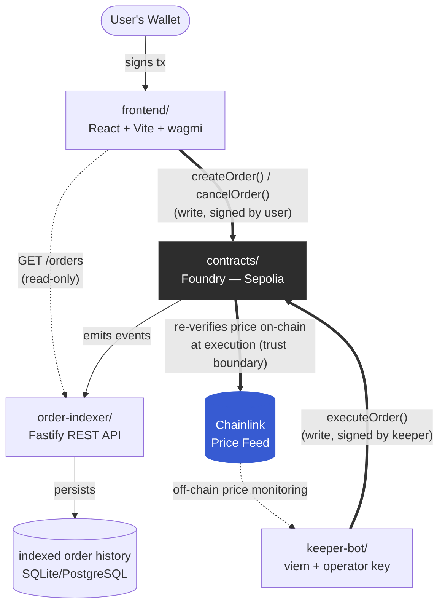

# OrderKeeper

A decentralized limit-order keeper bot for EVM chains. Users deposit funds and define a price condition (e.g. "sell 1 ETH when price >= $4,000"); an off-chain keeper bot monitors Chainlink price feeds and automatically executes the swap via Uniswap when the condition is met, earning a small fee for the service.

---

## Problem Statement

Limit orders are a basic trading primitive on centralized exchanges, but on-chain DEXs (like Uniswap) only support market swaps — there's no native way to say "execute this trade only when price reaches X" without either trusting a centralized service or manually watching the market yourself.

OrderKeeper solves this trustlessly: funds are custodied by a smart contract, execution conditions are verified on-chain against a Chainlink oracle, and anyone can run the keeper bot that triggers execution — no centralized party holds funds or controls execution.

---

## Why This Project

- **Real income potential**: the keeper fee mechanism means this isn't just a demo — it's a monetizable service.
- **Architecturally simple, not over-engineered**: unlike MEV liquidation/arbitrage bots (which require simulating market conditions that don't organically exist on testnet), OrderKeeper works end-to-end on Sepolia using a real Chainlink feed and real Uniswap liquidity.
- **Trustless by design**: the bot only *triggers* execution — the contract independently re-verifies the price against Chainlink before moving any funds, so a compromised or buggy bot can never force a false execution.

---

## Architecture

Four components, each with a single responsibility (simple microservices over a monorepo):

Thick arrows = on-chain writes into `contracts/` (or the contract's own on-chain re-check of Chainlink); dashed arrows = off-chain reads and monitoring, which never touch the write path.

### 1. `contracts/` — On-chain core
Custodies order funds, verifies price conditions on-chain, executes swaps.
- **Stack**: Foundry, OpenZeppelin (`IERC20`, `ReentrancyGuard`), Chainlink `AggregatorV3Interface`, Uniswap router interface
- **Core logic**: `createOrder()`, `executeOrder()` (re-validates price on-chain before executing), `cancelOrder()`, keeper fee on successful execution

### 2. `order-indexer/` — Event listener + read API
Listens for `OrderCreated` / `OrderExecuted` / `OrderCancelled` events, persists them, and exposes them over a REST API (e.g. `GET /orders`, `GET /orders/:id`) so the frontend and keeper don't need to query the chain directly on every read.
- **Stack**: Node.js, TypeScript, Fastify (REST API), viem (`watchContractEvent` over WebSocket), SQLite/PostgreSQL
- **Read-only**: never sends transactions, never holds a private key — smaller attack surface by design. It only serves reads of indexed history; it never sits in the write path — order creation and cancellation go directly from the frontend to the contract

### 3. `keeper-bot/` — Executor
Monitors the Chainlink feed and calls `executeOrder()` when a pending order's condition is met.
- **Stack**: Node.js, TypeScript, viem — holds its own operator private key (separate from user funds) to sign and send execution transactions

### 4. `frontend/` — User interface
Wallet connection, order creation/cancellation, order history and status.
- **Stack**: React + Vite + TypeScript (pure SPA, no SSR), viem, wagmi for wallet connection
- **Direct-to-contract writes**: order creation and cancellation are signed by the user's wallet and sent straight to the contract via wagmi/viem — the frontend talks to `order-indexer` only to read order history

---

## Security Considerations

- **Access control**: only the order owner can cancel their own order
- **Reentrancy protection**: `ReentrancyGuard` on any function moving funds; strict checks-effects-interactions ordering
- **Oracle trust boundary**: execution price is verified on-chain via Chainlink at execution time — the keeper bot is never trusted as a price source, only as a trigger
- **Key isolation**: the keeper bot's operator key is fully separate from user funds and from the indexer (which holds no key at all)

---

## Testing Plan

- **Unit tests** (Foundry) — order lifecycle: create, execute, cancel, unauthorized access, edge cases (zero amounts, expired orders)
- **Fork tests** — against Sepolia state, using the real Chainlink feed and Uniswap router
- **Fuzz tests** — price/amount boundaries around the execution condition
- **Invariant tests** — contract balance always matches the sum of active order amounts (solvency)

---

## Open Design Question

Should the keeper bot read pending orders directly from the contract (slower, but no dependency) or from the `order-indexer` (faster, but adds a dependency that must stay in sync)? Leaning toward starting with the indexer for speed, with a fallback path to direct contract reads if indexer freshness becomes a concern — to be finalized during the build phase.

---

## Roadmap (Bootcamp Timeline)

| Modules | Milestone | Status |
|---|---|---|
| 09–12 | Planning: architecture, contract design | This document |
| 12 | Project pitch | Tomorrow |
| 13–16 | Build: contracts + frontend + tests | Upcoming |
| 16 | MVP presentation | Upcoming |